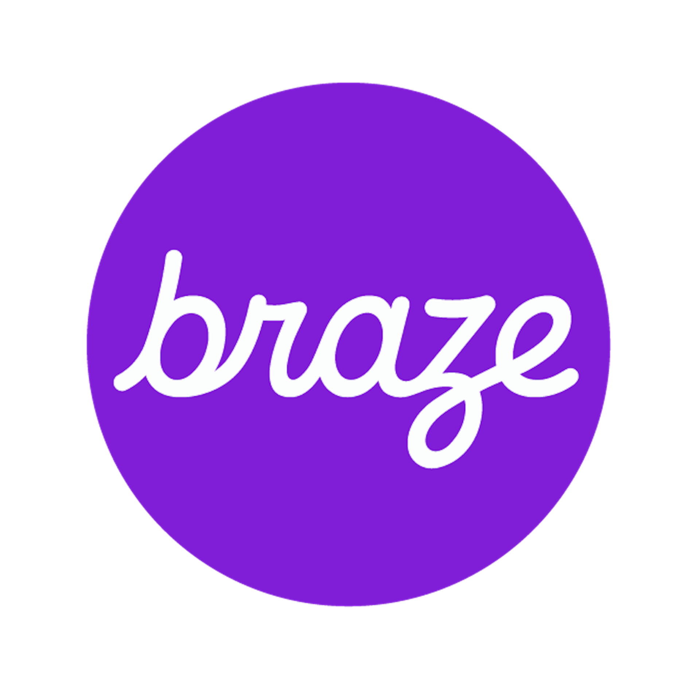
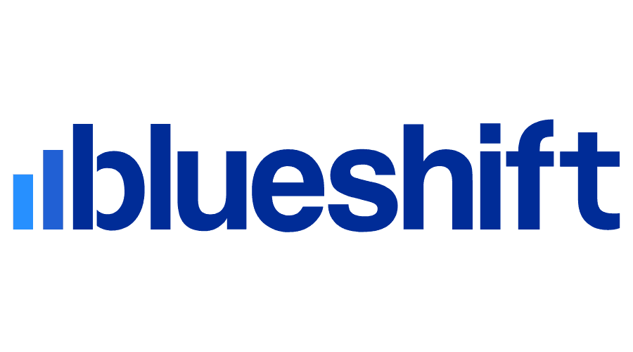

## 🦖 MJ - What I do

**CRM & Email Developer**  
*Building clean templates, dynamic contents, and the occasional side project.*

 
 
 

## 🕰 What I'm Working On
- Building and refining [mustafa-jung.com](https://www.mustafa-jung.com) — my personal site and development workshop
- Developing clean, modern projects
- Expanding my development skills

 
 

## 🛠 Workshop Projects
| Project Idea | Description |
|--------|----------|
| `AMPScript` | List of personalised data and dynamic blocks |
| `Liquid` | List of personalised data and dynamic blocks |
| `Email Templates` | List of email templates |

 
 

## 🛠 Tools

### Platforms

 
 

### Programming Languages

 
 

 
 

<!---

- 👋 Hi, I’m @mjgodzilla86
- 👀 I’m interested in ...
- 🌱 I’m currently learning new technical skills...
- 💞️ I’m looking to collaborate on ...
- 📫 How to reach me ...
- 😄 Pronouns: ...
- ⚡ Fun fact: ...

mjgodzilla86/mjgodzilla86 is a ✨ special ✨ repository because its `README.md` (this file) appears on your GitHub profile.
You can click the Preview link to take a look at your changes.
--->
